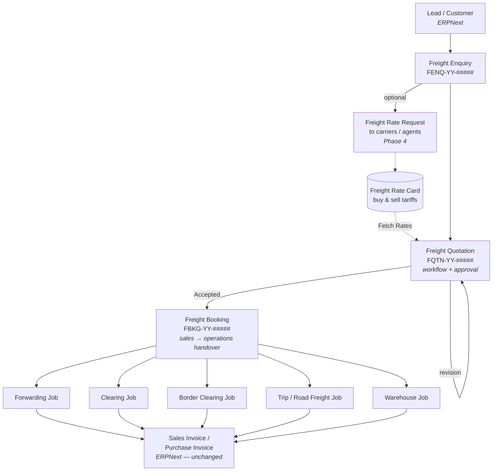

# FreightMas CRM Module — Design Specification

> **Purpose:** A complete design for a freight-forwarding-native sales process in FreightMas: **Freight Enquiry → Freight Quotation → Freight Booking → Operational Jobs**, backed by a **Rate Card** pricing engine, feeding the existing Forwarding, Port Clearing, Border Clearing, Trucking, Road Freight and Warehousing jobs, and integrating with ERPNext for accounting.
>
> This is a design document, not an implementation. It is written to be handed to a developer (or used as context for an AI coding assistant) and built phase by phase.

---

## Table of Contents

1. [Why a custom CRM](#1-why-a-custom-crm)
2. [What already exists today](#2-what-already-exists-today)
3. [Design principles](#3-design-principles)
4. [The sales process](#4-the-sales-process)
5. [Module layout and DocType inventory](#5-module-layout-and-doctype-inventory)
6. [DocType specifications](#6-doctype-specifications)
7. [The pricing engine](#7-the-pricing-engine)
8. [Conversion to jobs](#8-conversion-to-jobs)
9. [ERPNext accounting integration](#9-erpnext-accounting-integration)
10. [Roles, permissions and approvals](#10-roles-permissions-and-approvals)
11. [Reports, dashboards and workspace](#11-reports-dashboards-and-workspace)
12. [Coding standards to follow](#12-coding-standards-to-follow)
13. [Migration from the current Quotation flow](#13-migration-from-the-current-quotation-flow)
14. [Implementation phases](#14-implementation-phases)
15. [Deliberate exclusions](#15-deliberate-exclusions)

---

## 1. Why a custom CRM

The native ERPNext sales stack (`Lead → Opportunity → Quotation → Sales Order`) is built around **selling items out of stock**. Freight forwarding sells **a service across a trade lane**, and the mismatch shows up in five concrete places:

| Freight reality | ERPNext Quotation assumption | Consequence today |
|---|---|---|
| A quote line has a **buy rate and a sell rate** (you buy freight from a carrier and resell it) | A quote line has one `rate` | You bolted on `buy_rate` / `cost_amount` custom fields |
| A quote line is priced on a **basis**: per container, per BL, per kg, per W/M, per truck, per day | Quantity × rate, with stock UOM semantics | Basis is buried in free text; no rate lookup possible |
| A quote covers **several legs** (origin, ocean freight, port clearance, border, trucking, storage) that later become **different job types** | Flat item list with no leg concept | Only Forwarding is wired up (`Job Order`); the other five job types get nothing from sales |
| Pricing is driven by **lane tariffs** (Durban→Harare, 40ft, Import, valid to 31 Dec) | `Item Price` keyed on item + price list + customer | No lane dimension, so no reusable pricing tool exists |
| An **enquiry** exists before a quote and often never becomes one; response time and hit rate are the sales KPIs | `Opportunity` is generic, with no lane, cargo or service scope | Enquiries live in email; no win/loss data |

The goal is **not** to reimplement ERPNext. It is to add a thin, freight-shaped sales layer that reuses ERPNext where ERPNext is genuinely good (`Customer`, `Lead`, `Contact`, `Item` as the charge master, `Supplier`, `Currency`, `UOM`, `Payment Term`, `Terms and Conditions`, and the whole invoicing/GL stack) and replaces it only where the shape is wrong.

---

## 2. What already exists today

Worth being precise about this, because a lot of the target design is already half-built and should be absorbed rather than duplicated.

**Already in place:**

- ERPNext `Quotation` extended with 15 custom fields: `is_freight_quote`, `job_type`, `job_description`, `origin_port`, `port_of_discharge`, `destination_port`, `customer_reference`, `bundle_charges`, `est_revenue`, `est_cost`, `est_profit`, `custom_job_order_reference`; and on `Quotation Item`: `supplier`, `buy_rate`, `cost_amount`.
- A `Quotation Workflow` fixture: `Draft → Pending Approval → Approved → Sent to Customer → Accepted / Rejected / Expired → JO Created`, gated by `Sales User` / `Sales Manager`.
- `freightmas/utils/quotation.py` — workflow validation, three notification emails, and `create_job_order_from_quotation()`.
- `freightmas/scheduler/quotation.py` — daily auto-expiry of quotations past `valid_till`.
- **`Job Order`** (`FWJO-.#####.-.YY`, submittable) — the sales→operations handover document, with `job_order_charges` (Item, qty, sell_rate, buy_rate, supplier, customer), a documents checklist, routing and service details, `validate_for_conversion()`, assignment to an operations user, and `create_forwarding_job()`.
- Reports: `Quotation List`, `Quotation Report`, `Quotation Conversion Tracker`, `Unconverted Quotations`, `Forwarding Sales Pipeline`.
- A `FreightMas Sales` workspace.
- Charge-template precedents: `Clearing Charges Template` (keyed on shipping line + container type + direction), `DND Storage Rate Card`, `Storage Rate Card`, `Customer Warehouse Rates`.
- Every job type already separates **quoted** charges from **working** charges (e.g. `forwarding_costing_charges` vs `forwarding_revenue_charges` / `forwarding_cost_charges`) with `total_quoted_revenue`, `total_quoted_cost`, `total_quoted_margin` fields.
- Invoicing and WIP revenue/cost recognition already run off job charges via `custom_*_job_reference` fields on Sales/Purchase Invoice.

**The gaps this design fills:**

1. No enquiry stage — nothing to measure response time or hit rate against.
2. `Job Order` is **Forwarding-only**; Clearing, Border Clearing, Trucking, Road Freight and Warehousing have no sales entry point.
3. No rate cards, so every quote is priced from scratch by hand.
4. Quote lines have no **basis** and no **leg**, so they cannot be routed to the right job automatically.
5. Quoted margin is never compared to actual job margin.

---

## 3. Design principles

These are the rules the implementation must hold to. They are deliberately conservative.

1. **DocTypes first, code second.** Nearly everything is field definitions, Link fields and child tables. Python is for validation, totals, and conversion — nothing else.
2. **Reuse ERPNext masters.** `Item` stays the charge master (it carries the income and expense accounts that make invoicing work). `Customer`, `Lead`, `Supplier`, `Contact`, `Currency`, `UOM`, `Payment Term`, `Terms and Conditions`, `Sales Person`, `Company`, `Incoterm` are all reused as-is.
3. **One document, one purpose.** An enquiry is a question. A quotation is an offer. A booking is a commitment. A job is execution. No document does two of these.
4. **The CRM layer never touches the GL.** Enquiries, quotations, bookings and rate cards create zero accounting entries. Accounting begins where it begins today: at the job's Sales Invoice / Purchase Invoice.
5. **Jobs remain independently creatable.** Repeat customers on standing rates will always create jobs directly. The CRM path is additive, never mandatory.
6. **Follow ERPNext idiom.** `get_mapped_doc` for conversions, `frappe.whitelist()` + `frm.add_custom_button` for actions, naming series in JSON, workflows in fixtures, totals computed server-side in `validate()`.
7. **No rules engine, no scripting layer, no formula fields.** Rate lookup is a deterministic, documented match-and-rank query in one Python module.

---

## 4. The sales process



**The four stages in words:**

| Stage | Document | Submittable | Question it answers |
|---|---|---|---|
| Demand capture | **Freight Enquiry** | No | *What is the customer asking for, who owns it, and did we respond in time?* |
| Offer | **Freight Quotation** | Yes (+ workflow) | *What exactly are we offering, at what price, at what margin, valid until when?* |
| Commitment | **Freight Booking** | Yes | *The customer said yes — what does operations need, and which jobs must exist?* |
| Execution | **Jobs** (existing) | Yes | *What actually happened, and what did it actually cost?* |

**Why a separate Booking document rather than quotation → job directly.** Three reasons, and they are the same reasons ERPNext puts a Sales Order between Quotation and Delivery Note:

- A quotation is often for **two or three options**; the booking records which one the customer actually took, and for which of several possible shipments.
- Operations needs information sales does not put in a quote: loading and offloading addresses, contact people, cut-off dates, special instructions, document checklists.
- **One accepted quotation can produce several jobs** (a Forwarding Job *and* a Trip *and* a Warehouse Job). The booking is the fan-out point; without it, that logic has to live on the quotation and gets ugly.

`Freight Booking` is the generalisation of the existing `Job Order` — the same role, but for all six job types instead of Forwarding only.

**A note on skipping stages.** Not every enquiry becomes a quotation, and not every quotation needs an enquiry. `Freight Quotation.enquiry` is optional, so a walk-up quote is one document. Only the Quotation → Booking → Job path is enforced, so conversion analytics stay reliable.

---

## 5. Module layout and DocType inventory

### 5.1 Module name

Add a new module to `freightmas/modules.txt`:

```
FreightMas CRM
```

> **Important:** do **not** call the module `CRM`. ERPNext already registers a `CRM` module and the standalone Frappe CRM app registers others; `Module Def` names are global across installed apps, so a bare `CRM` will collide.

### 5.2 Directory structure

```
freightmas/freightmas_crm/
├── __init__.py
├── doctype/
│   ├── freight_enquiry/
│   ├── freight_enquiry_cargo/            (child)
│   ├── freight_quotation/
│   ├── freight_quotation_cargo/          (child)
│   ├── freight_quotation_charge/         (child)
│   ├── freight_booking/
│   ├── freight_booking_service/          (child)
│   ├── freight_rate_card/
│   ├── freight_rate_card_item/           (child)
│   └── enquiry_lost_reason/              (small master)
├── rate_engine.py                        # rate card lookup — one module
├── job_creation.py                       # booking → jobs fan-out
├── report/
│   ├── freight_enquiry_register/
│   ├── enquiry_response_sla/
│   ├── freight_quotation_register/
│   ├── quotation_win_loss_analysis/
│   ├── quoted_vs_actual_margin/
│   ├── rate_card_expiry/
│   └── charge_items_missing_accounts/
└── workspace/
    └── freightmas_crm/
```

### 5.3 DocType inventory

| DocType | Type | Naming | Submittable | Phase |
|---|---|---|---|---|
| Freight Enquiry | Master | `FENQ-.YY.-.#####.` | No | 1 |
| Freight Enquiry Cargo | Child | — | — | 1 |
| Enquiry Lost Reason | Master | `field:reason` | No | 1 |
| Freight Quotation | Transaction | `FQTN-.YY.-.#####.` | Yes + workflow | 1 |
| Freight Quotation Cargo | Child | — | — | 1 |
| Freight Quotation Charge | Child | — | — | 1 |
| Freight Booking | Transaction | `FBKG-.YY.-.#####.` | Yes | 2 |
| Freight Booking Service | Child | — | — | 2 |
| Freight Rate Card | Master | `FRC-.YY.-.#####.` | No | 3 |
| Freight Rate Card Item | Child | — | — | 3 |

Existing naming series in use — `FWJB`, `CLJB`, `BCJB`, `TRIP`, `WHJB`, `RFJB`, `FWJO`, `FWSO`, `DND-RATE` — none of the new prefixes collide.

### 5.4 Two shared Select options

These two lists appear on quotation charges, rate card items and booking services. Define them once (in the JSON `options`, and mirrored as constants in `freightmas_crm/constants.py`) and never diverge.

**`charge_basis`** — how a charge is quantified:

```
Per Container
Per BL
Per Shipment
Per Truck
Per Trip
Per KG
Per Tonne
Per CBM
Per W/M
Per Pallet
Per Package
Per Day
Per Entry
Percentage
Lumpsum
```

**`service_leg`** — which part of the door-to-door chain a charge belongs to. This is the single most important field in the design: it is what lets one quotation feed six different job types without any complicated logic.

```
Origin
Freight
Destination
Port Clearance
Border Clearance
Trucking
Warehousing
Other
```

---

## 6. DocType specifications

Field lists below are the meaningful fields. Section, column and tab breaks are laid out at build time following the conventions already used in `Forwarding Job`.

### 6.1 Freight Enquiry

**Naming:** `FENQ-.YY.-.#####.` · **Submittable:** No · **Module:** FreightMas CRM

| Field | Type | Options / notes |
|---|---|---|
| `naming_series` | Select | `FENQ-.YY.-.#####.` |
| `company` | Link | Company, reqd, default from session |
| `enquiry_date` | Date | reqd, default Today |
| `enquiry_to` | Select | `Lead` / `Customer`, reqd, default Customer |
| `party_name` | Dynamic Link | options `enquiry_to`, reqd |
| `party_display_name` | Read Only | fetched |
| `contact_person` | Link | Contact, `set_query` filtered to the party |
| `contact_email` / `contact_phone` | Data | fetched from Contact |
| `source` | Select | `Email`, `Phone`, `Client Portal`, `Website`, `Referral`, `Walk-in`, `Tender`, `Existing Customer` |
| `sales_person` | Link | Sales Person; defaults from the Customer's sales team |
| `respond_by` | Datetime | SLA target; default = enquiry_date + N hours from FreightMas Settings |
| `status` | Select | `Open`, `Quoted`, `Won`, `Lost`, `No Bid`, `Cancelled` — **set by code, read-only in the UI** |
| **Service scope** | | Mirrors `Forwarding Job` exactly so the fields carry through untouched |
| `requires_sea_air_freight` | Check | |
| `requires_port_clearance` | Check | |
| `requires_border_clearance` | Check | |
| `requires_trucking` | Check | |
| `requires_warehousing` | Check | |
| **Trade lane** | | |
| `direction` | Select | `Import`, `Export`, `Local`, `Transit` |
| `shipment_mode` | Select | `Sea`, `Air`, `Road`, `Rail` |
| `shipment_type` | Select | `FCL`, `LCL`, `Consol`, `Breakbulk`, `Bulk`, `Groupage` |
| `port_of_loading` | Link | Port |
| `port_of_discharge` | Link | Port |
| `final_destination` | Link | Port |
| `border_post` | Link | Border Post, shown when `requires_border_clearance` |
| `incoterms` | Link | Incoterm |
| `incoterm_place` | Data | |
| **Cargo** | | |
| `cargo_description` | Small Text | reqd |
| `commodity_hs_code` | Data | |
| `is_hazardous` / `imo_class` / `un_number` | Check / Data / Data | `imo_class`, `un_number` depend on `is_hazardous` |
| `is_temperature_controlled` / `temperature_range` | Check / Data | |
| `cargo_details` | Table | **Freight Enquiry Cargo** |
| `total_gross_weight` / `total_volume_cbm` | Float | computed from the table, read-only |
| `cargo_value` / `cargo_value_currency` | Currency / Link | for insurance quoting |
| **Dates** | | |
| `cargo_ready_date` | Date | |
| `required_delivery_date` | Date | |
| **Outcome** | | |
| `quotation_count` | Int | read-only, maintained by code |
| `lost_reason` | Link | Enquiry Lost Reason, mandatory when status = `Lost` |
| `competitor` | Data | |
| `remarks` | Text Editor | |

**Controller logic (`freight_enquiry.py`) — the whole of it:**

- `validate()` → `set_party_details()`, `calculate_cargo_totals()`, `validate_lost_reason()`, `set_default_respond_by()`
- `set_status()` — called from `Freight Quotation.on_submit` / `on_cancel` and from the booking, never edited by hand. `Open` when no quotations exist, `Quoted` when at least one is submitted, `Won` when one is accepted, `Lost` / `No Bid` set manually via a button.
- A `freight_enquiry_dashboard.py` exposing linked `Freight Quotation`.

**Client script:** one button, `Create → Quotation`, calling the mapper below.

### 6.2 Freight Enquiry Cargo (child)

| Field | Type | Notes |
|---|---|---|
| `package_type` | Select | `Container`, `Pallet`, `Carton`, `Drum`, `Bag`, `Crate`, `Loose`, `Bulk` |
| `container_type` | Link | Container Type, shown when `package_type = Container` |
| `qty` | Float | in list view |
| `gross_weight` | Float | kg |
| `volume_cbm` | Float | |
| `length` / `width` / `height` | Float | cm, for out-of-gauge |
| `remarks` | Data | |

### 6.3 Freight Quotation

**Naming:** `FQTN-.YY.-.#####.` · **Submittable:** Yes · **Workflow:** yes (§10)

| Field | Type | Options / notes |
|---|---|---|
| `naming_series` | Select | `FQTN-.YY.-.#####.` |
| `company` | Link | Company, reqd |
| `enquiry` | Link | Freight Enquiry, optional |
| `quotation_to` | Select | `Lead` / `Customer`, reqd |
| `party_name` | Dynamic Link | reqd |
| `contact_person` | Link | Contact |
| `quotation_date` | Date | reqd, default Today |
| `valid_till` | Date | reqd; default = quotation_date + N days from FreightMas Settings |
| `sales_person` | Link | Sales Person |
| `customer_reference` | Data | |
| **Revisions** | | |
| `revision_of` | Link | Freight Quotation, read-only |
| `revision_number` | Int | read-only, default 0 |
| `is_superseded` | Check | read-only |
| **Service scope, trade lane, cargo** | | Identical field set to Freight Enquiry (§6.1), so `get_mapped_doc` carries them across with no field map |
| `cargo_details` | Table | **Freight Quotation Cargo** (same schema as Freight Enquiry Cargo) |
| `transit_time_days` | Int | quoted transit time |
| `free_days_offered` | Int | detention/demurrage free days offered |
| `route` | Link | Road Freight Route, when mode = Road |
| **Currency** | | |
| `currency` | Link | Currency, reqd |
| `conversion_rate` | Float | reqd; standard ERPNext exchange-rate fetch |
| `base_currency` | Read Only | company default currency |
| **Charges** | | |
| `fetch_rates` | Button | calls the rate engine (§7) |
| `charges` | Table | **Freight Quotation Charge** |
| `total_sell` / `total_sell_base` | Currency | read-only |
| `total_buy` / `total_buy_base` | Currency | read-only |
| `gross_margin` / `gross_margin_base` | Currency | read-only |
| `margin_percent` | Percent | read-only |
| `requires_approval` | Check | read-only, set in `validate()` (§10) |
| **Terms** | | |
| `payment_terms` | Link | Payment Term |
| `terms_and_conditions` | Link | Terms and Conditions |
| `terms` | Text Editor | fetched from the above, editable |
| `inclusions` / `exclusions` | Text Editor | freight quotes live or die on exclusions — make them a first-class field, not a note |
| `remarks` | Text Editor | |
| **Outcome** | | |
| `workflow_state` | Link | Workflow State (§10) |
| `accepted_on` / `lost_on` | Date | read-only |
| `lost_reason` | Link | Enquiry Lost Reason |
| `competitor` / `competitor_price` | Data / Currency | |
| `freight_booking` | Link | Freight Booking, read-only, set on conversion |

**Controller logic (`freight_quotation.py`):**

```
validate():
    set_party_details()
    set_missing_defaults()          # currency, conversion rate, valid_till, base_currency
    validate_validity_period()      # valid_till >= quotation_date
    calculate_charge_amounts()      # per row: buy_amount, sell_amount, margin
    calculate_totals()              # doc totals in quote currency and base currency
    set_approval_flag()             # margin below threshold → requires_approval = 1
    validate_charge_items()         # every charge Item exists and is not disabled

on_submit():   update_enquiry_status()
on_cancel():   update_enquiry_status()
```

Plus three whitelisted methods:

- `fetch_rates(quotation_name)` → calls `rate_engine.get_rates()` and appends rows (§7)
- `make_revision(quotation_name)` → copies the doc, sets `revision_of` and `revision_number + 1`, marks the source `is_superseded`
- `make_freight_booking(source_name, target_doc=None)` → `get_mapped_doc` (§8)

**Handling alternatives (Sea vs Air, via Durban vs via Beira).** One quotation is **one priced offer**. Alternatives are sibling quotations from the same enquiry — the enquiry's dashboard shows them together and the `Freight Quotation Register` report groups by enquiry. Nested option tables were considered and rejected: Frappe does not support tables inside child tables, so options would require a fourth parent-child DocType pair for a case that a second quotation handles perfectly well.

### 6.4 Freight Quotation Charge (child) — the core table

| Field | Type | List view | Notes |
|---|---|---|---|
| `charge` | Link → **Item** | ✓ | reqd. The charge master; carries income/expense accounts |
| `description` | Small Text | | fetched from Item, editable |
| `service_leg` | Select | ✓ | §5.4. **Drives job routing on conversion** |
| `charge_basis` | Select | ✓ | §5.4 |
| `qty` | Float | ✓ | default 1 |
| `uom` | Link → UOM | | fetched from Item |
| `buy_rate` | Currency | ✓ | options: `currency` |
| `buy_amount` | Currency | | read-only = `qty × buy_rate` |
| `supplier` | Link → Supplier | ✓ | the carrier / agent / transporter the cost is payable to |
| `sell_rate` | Currency | ✓ | options: `currency` |
| `sell_amount` | Currency | | read-only = `qty × sell_rate` |
| `margin_amount` | Currency | | read-only |
| `margin_percent` | Percent | | read-only |
| `minimum_charge` | Currency | | if `sell_amount < minimum_charge`, `sell_amount = minimum_charge` |
| `is_optional` | Check | | quoted but not included in totals; printed as "on request" |
| `is_disbursement` | Check | | pass-through (duty, VAT, port dues) — excluded from margin % |
| `rate_card` | Link → Freight Rate Card | | read-only, set when fetched — the audit trail for "where did this rate come from" |
| `remarks` | Data | | |

**Single document currency, not per-line.** Ocean freight in USD alongside local charges in ZAR is real, but per-line currency means per-line conversion rates, per-line revaluation and three sets of totals — and every existing FreightMas job charge table is single-currency. Keep it consistent: the rate engine converts supplier rates into the quotation currency at fetch time and stores the source rate in `remarks`. Revisit only if it becomes a genuine operational problem.

### 6.5 Freight Booking

**Naming:** `FBKG-.YY.-.#####.` · **Submittable:** Yes

| Field | Type | Notes |
|---|---|---|
| `naming_series` | Select | `FBKG-.YY.-.#####.` |
| `company` | Link | Company, reqd |
| `quotation` | Link | Freight Quotation, reqd, read-only after submit |
| `customer` | Link | Customer, reqd |
| `booking_date` | Date | reqd, default Today |
| `customer_reference` | Data | reqd — the customer's own PO / reference |
| **Parties** | | |
| `shipper` / `consignee` / `notify_party` | Link → Customer | `consignee` reqd |
| `origin_agent` / `port_clearing_agent` / `border_clearing_agent` | Link → Supplier | |
| **Trade lane, cargo, service scope** | | Copied from the quotation |
| `cargo_details` | Table | Freight Quotation Cargo (reused) |
| **Operational handover** | | The information sales must collect but a quote never carries |
| `loading_address` / `offloading_address` | Small Text | |
| `loading_instructions` / `special_instructions` | Small Text | |
| `cargo_ready_date` / `required_delivery_date` / `eta` | Date | |
| `documents_checklist` | Table | **Forwarding Documents Checklist** (reused as-is) |
| `prepared_by` | Link → User | sales owner, default session user |
| `assigned_to` | Link → User | operations owner; drives a ToDo assignment as `Job Order` does today |
| **Charges** | | |
| `currency` / `conversion_rate` / `base_currency` | Link / Float / Read Only | |
| `charges` | Table | **Freight Quotation Charge** (reused — same schema, no new DocType) |
| `total_sell` / `total_buy` / `gross_margin` / `margin_percent` | Currency / Percent | read-only |
| **Job fan-out** | | |
| `services` | Table | **Freight Booking Service** |
| `all_jobs_created` | Check | read-only |
| `status` | Select | `Draft`, `Pending Job Creation`, `Jobs Created`, `Completed`, `Cancelled` |

**Controller logic (`freight_booking.py`):**

```
validate():
    validate_quotation()            # exists, submitted, workflow_state == Accepted
    validate_duplicate_booking()    # one live booking per quotation
    fetch_from_quotation()          # only when charges table is empty
    populate_services()             # only when services table is empty; from service scope checks
    calculate_totals()
    validate_for_handover()         # on before_submit: consignee, lane, dates, incoterm all present

on_submit():    assign_to_operations()
on_cancel():    block if any service row has a job_reference
```

Then one whitelisted method, `create_jobs(booking_name)` (§8).

`validate_for_handover()` should reuse the pattern already proven in `Job Order.validate_for_conversion()` — collect missing field labels, raise one `frappe.throw` listing them all. Do not raise one error at a time.

### 6.6 Freight Booking Service (child)

| Field | Type | List view | Notes |
|---|---|---|---|
| `service_type` | Select | ✓ | `Forwarding`, `Port Clearing`, `Border Clearing`, `Trucking`, `Road Freight`, `Warehousing` |
| `job_doctype` | Read Only | | derived from `service_type` via the dispatch map (§8.1) |
| `job_reference` | Dynamic Link | ✓ | options `job_doctype`, read-only, set on creation |
| `is_primary` | Check | | exactly one row; the job that receives `service_leg = Other` charges |
| `status` | Select | ✓ | `Pending`, `Created`, `Skipped`, `Cancelled` |
| `remarks` | Data | | |

### 6.7 Freight Rate Card

**Naming:** `FRC-.YY.-.#####.` · **Submittable:** No (rate cards are edited, not amended)

| Field | Type | Notes |
|---|---|---|
| `rate_card_name` | Data | reqd — e.g. "Maersk Durban→Harare Import FCL 2026" |
| `card_type` | Select | `Buy` (supplier tariff), `Sell` (customer contract), `Standard` (default sell tariff), reqd |
| `party_type` | Select | `Supplier` / `Customer` / blank; blank = applies to everyone |
| `party` | Dynamic Link | options `party_type` |
| `company` | Link | Company, reqd |
| **Applicability** | | Every dimension is optional; blank means "any". Specificity ranks (§7.2) |
| `service_leg` | Select | §5.4 |
| `direction` | Select | Import / Export / Local / Transit |
| `shipment_mode` | Select | Sea / Air / Road / Rail |
| `shipment_type` | Select | FCL / LCL / Consol / Breakbulk / Bulk / Groupage |
| `port_of_loading` / `port_of_discharge` / `final_destination` | Link → Port | |
| `border_post` | Link → Border Post | |
| `shipping_line` | Link → Shipping Line | |
| `container_type` | Link → Container Type | |
| **Validity** | | |
| `currency` | Link | reqd |
| `valid_from` / `valid_to` | Date | `valid_from` reqd |
| `is_active` | Check | default 1 |
| `priority` | Int | default 0; higher wins the final tie-break |
| `items` | Table | **Freight Rate Card Item** |
| `notes` | Text Editor | inclusions, exclusions, surcharge conditions |

### 6.8 Freight Rate Card Item (child)

| Field | Type | Notes |
|---|---|---|
| `charge` | Link → Item | reqd |
| `description` | Small Text | |
| `charge_basis` | Select | §5.4, reqd |
| `service_leg` | Select | defaults from the parent card |
| `min_qty` / `max_qty` | Float | weight/volume breaks — air freight `-45 / +45 / +100 / +300 / +500 / +1000`. `max_qty = 0` means no ceiling |
| `rate` | Currency | reqd |
| `minimum_charge` | Currency | |
| `supplier` | Link → Supplier | for buy cards where the card party is blank |
| `uom` | Link → UOM | |
| `is_disbursement` / `is_optional` | Check | carried through to the quotation charge row |

**Deliberately absent:** percentage-of-another-line formulas, currency-adjustment factors, and conditional surcharges. Those are the features that turn a rate card into a scripting language. If a surcharge depends on another line, quote it as its own line.

---

## 7. The pricing engine

One Python module, `freightmas_crm/rate_engine.py`. Target size: about 150 lines.

### 7.1 The single entry point

```python
@frappe.whitelist()
def get_rates(context: dict) -> list[dict]:
    """Return quotation charge rows for a trade-lane context.

    context keys: company, currency, service_legs (list), direction,
        shipment_mode, shipment_type, port_of_loading, port_of_discharge,
        final_destination, border_post, shipping_line, container_type,
        customer, supplier, quotation_date, cargo (list of qty/weight/volume)

    Returns one dict per charge, ready to append to Freight Quotation.charges.
    """
```

Called from the `Fetch Rates` button on `Freight Quotation`, and available to jobs later if they want the same lookup.

### 7.2 The matching rule

Deterministic and explainable — a pricing officer must be able to answer "why did it pick that card?" without reading code.

**Step 1 — filter** (`Freight Rate Card` rows that survive):
- `is_active = 1`
- `company` matches
- `valid_from <= quotation_date` and (`valid_to` is null or `valid_to >= quotation_date`)
- `service_leg` is blank or in the requested legs
- Every non-blank applicability field on the card matches the context. A **blank field on the card matches anything**; a non-blank field must match exactly.

**Step 2 — score** each surviving card. Sum the weights of its non-blank dimensions:

| Dimension | Weight |
|---|---|
| Exact `party` match (customer for Sell, supplier for Buy) | 100 |
| `port_of_loading` + `port_of_discharge` + `final_destination` all set | 50 |
| `port_of_loading` + `port_of_discharge` set | 30 |
| `container_type` or `shipment_type` set | 20 |
| `shipping_line` or `border_post` set | 20 |
| `direction` set | 10 |
| `shipment_mode` set | 5 |

**Step 3 — rank** by: score DESC, then `priority` DESC, then `valid_from` DESC, then `modified` DESC. Take the top **Buy** card and the top **Sell** card per `service_leg`.

**Step 4 — build rows.** For each item on the winning card(s), resolve `qty` from `charge_basis` against the cargo context:

| `charge_basis` | qty from |
|---|---|
| Per Container | count of container rows (filtered by `container_type` if the card names one) |
| Per BL / Per Shipment / Lumpsum / Per Entry | 1 |
| Per Truck / Per Trip | number of trucks required |
| Per KG / Per Tonne | total gross weight (÷ 1000 for tonnes) |
| Per CBM | total volume |
| Per W/M | `max(total_tonnes, total_cbm)` — the freight-industry weight-or-measure rule |
| Per Pallet / Per Package | count of package rows |
| Per Day | free-text; qty left at 1 for the user to set |
| Percentage | qty = 1; the user enters the base amount as `buy_rate` / `sell_rate` |

Then apply the `min_qty` / `max_qty` break, apply `minimum_charge`, convert currency if the card currency differs from the quotation currency (via `erpnext.setup.utils.get_exchange_rate`), and merge the Buy row and Sell row for the same `charge` + `service_leg` into a single quotation charge line.

**Step 5 — fall back.** Charges with no matching Sell card come back with `buy_rate` filled and `sell_rate` at zero, flagged in the message: *"3 charges have no sell rate — please price manually."* Never invent a sell rate from a markup percentage unless the user explicitly asks for one via a separate `Apply Markup` action.

### 7.3 Why not ERPNext `Item Price`

`Item Price` already has customer, supplier, price list, `valid_from` / `valid_upto`, `min_qty` and UOM — a real argument for reuse. It was rejected because:

- It has **no lane dimension**. Adding `port_of_loading`, `port_of_discharge`, `direction`, `container_type` and `service_leg` as custom fields means ERPNext's own `get_item_price()` cannot use them, so you write the whole lookup yourself anyway — with none of the benefit and all of the coupling to ERPNext's pricing-rule machinery.
- A lane tariff is **a set of charges for a lane**, not eighteen unrelated price rows. Sales people talk about "the Maersk Durban card", and want to open it, see all eighteen lines, and change the validity date once. A card models that; `Item Price` does not.
- Rate cards need `charge_basis` and `minimum_charge` per line, which have no `Item Price` equivalent.

The two coexist harmlessly: `Item Price` continues to serve any conventional ERPNext selling you do.

### 7.4 What happens to the existing templates

`Clearing Charges Template` (shipping line + container type + direction) is a `Sell` rate card with `service_leg = Port Clearance` in the new model. Leave it in place and working; add a small one-off script in Phase 3 that generates equivalent `Freight Rate Card` records from it, and deprecate the template once the cards are in use. `DND Storage Rate Card`, `Storage Rate Card` and `Customer Warehouse Rates` are **calculation** rate cards (they drive automatic charge computation on live jobs, not quoting) — leave them entirely alone.

---

## 8. Conversion to jobs

### 8.1 The dispatch map

One dict, in `freightmas_crm/job_creation.py`:

```python
SERVICE_JOB_MAP = {
    "Forwarding":      "Forwarding Job",
    "Port Clearing":   "Clearing Job",
    "Border Clearing": "Border Clearing Job",
    "Trucking":        "Trip",
    "Road Freight":    "Road Freight Job",
    "Warehousing":     "Warehouse Job",
}
```

### 8.2 Charge routing

When a booking creates jobs, its charges are grouped by `service_leg` and each group goes to the job that owns that leg:

| `service_leg` | Target job | Target table |
|---|---|---|
| Origin, Freight, Destination | Forwarding Job | `forwarding_costing_charges` |
| Port Clearance | Clearing Job, else Forwarding Job | `clearing_costing_charges` |
| Border Clearance | Border Clearing Job, else Forwarding Job | `border_clearing_costing_charges` |
| Trucking | Trip or Road Freight Job, else Forwarding Job | `trip_revenue_charges` / `road_freight_charges` |
| Warehousing | Warehouse Job, else Forwarding Job | `handling_charges` |
| Other | the row flagged `is_primary` | — |

"else Forwarding Job" matters: a forwarder often runs port clearance inside the forwarding file rather than opening a separate Clearing Job. If the booking has no service row for that job type, the charges fall through to the primary job. The user controls this by which rows they put in `services`.

**Charges land in the *quoted* table, not the working table.** `Forwarding Job.forwarding_costing_charges` already feeds `total_quoted_revenue` / `total_quoted_cost` / `total_quoted_margin`, and operations already pushes those into working charges with the existing *Fetch Revenue from Job Costing* button. This is exactly how `Job Order → Forwarding Job` behaves today, and it is the right behaviour: **the quote is a plan, not an actual.** Every other job type needs an equivalent quoted table added (§14, Phase 2/3).

### 8.3 Use `get_mapped_doc`, not hand-copying

The existing `create_forwarding_job()` copies ~20 fields by hand. That works but drifts every time a field is added. Every conversion in this design uses ERPNext's standard mapper:

```python
from frappe.model.mapper import get_mapped_doc

@frappe.whitelist()
def make_freight_quotation(source_name, target_doc=None):
    return get_mapped_doc("Freight Enquiry", source_name, {
        "Freight Enquiry": {
            "doctype": "Freight Quotation",
            "field_map": {"name": "enquiry"},
            "validation": {"status": ["!=", "Cancelled"]},
        },
        "Freight Enquiry Cargo": {
            "doctype": "Freight Quotation Cargo",
        },
    }, target_doc)
```

Because Enquiry, Quotation and Booking share identical field names for service scope, trade lane and cargo, the field maps stay almost empty — which is the whole point of naming them identically in §6.

For booking → jobs, `get_mapped_doc` is used per job type, with a `postprocess` that appends the routed charges.

### 8.4 Guard rails

- A booking can be created only from a quotation whose `workflow_state = Accepted`.
- One live (`docstatus < 2`) booking per quotation.
- `create_jobs()` is idempotent: rows already carrying a `job_reference` are skipped.
- A booking cannot be cancelled once any job exists — mirrors `Job Order.on_cancel()`.
- Every created job gets a back-reference: add a `freight_booking` Link field to each of the six job DocTypes (a small DocType change, not a custom field, since these are FreightMas DocTypes).

---

## 9. ERPNext accounting integration

**The CRM layer creates no accounting entries.** That is the design, and it should be stated in the module docstring so nobody adds one later.

The integration point is `Item`. Every charge on a quotation, rate card and booking is a Link to `Item`, and the job's charges are already `Item` links, so the existing chain is untouched:

```
Freight Quotation Charge (Item)
   → Freight Booking charges (Item)
      → Job costing charges (Item)          ← quoted
         → Job revenue / cost charges (Item) ← working
            → Sales Invoice / Purchase Invoice Item (Item)
               → GL, via the existing custom_*_job_reference linkage,
                 the FreightMasSalesInvoice / FreightMasPurchaseInvoice
                 overrides, and WIP revenue/cost recognition
```

**The one real requirement this places on the setup:** every charge `Item` must be a **non-stock service item** (`is_stock_item = 0`) with **Item Defaults** carrying an income account and an expense account for each company. If it does not, invoicing later fails — and it fails at invoice time, weeks after the quote, which is a miserable place to discover it.

Handle this with a report rather than a hard validation:

- **`Charge Items Missing Accounts`** — lists Items used on quotations/rate cards that lack income or expense account defaults. Put it on the CRM workspace and check it monthly.
- Optionally, a soft `frappe.msgprint` warning (not `throw`) in `Freight Quotation.validate()` when a charge Item has no income account. A hard throw would block sales for an accounting setup problem, which is the wrong trade-off.

**Foreign currency.** `conversion_rate` is captured on the quotation and booking and stored alongside base-currency totals, so quoted-vs-actual margin reporting is comparable in base currency regardless of quote currency. Standard ERPNext exchange-rate fetch (`erpnext.setup.utils.get_exchange_rate`) — do not write your own.

**Taxes.** Freight quotes in the region are typically quoted exclusive, with VAT applied at invoice. Keep it that way: **no tax table on the quotation.** Show a note in the print format ("All rates exclusive of VAT where applicable"). Tax is applied on the Sales Invoice by the existing ERPNext tax template. Adding a tax table to the quotation buys nothing and creates a second place for tax logic to be wrong.

**Credit control.** Add a soft warning on `Freight Booking.validate()` if the customer is over their ERPNext credit limit or has overdue invoices — read-only, via `frappe.db.get_value` on `Customer.credit_limit` and the existing outstanding-amount reports. Do not block; sales and credit control is a management conversation, not a validation.

---

## 10. Roles, permissions and approvals

### 10.1 Roles

| Role | Source | Permissions |
|---|---|---|
| `Sales User` | ERPNext | Freight Enquiry: create/read/write/delete-own. Freight Quotation: create/read/write, submit. Rate Card: read only. Booking: read. |
| `Sales Manager` | ERPNext | Everything Sales User has, plus approve quotations, cancel, amend, and write Rate Cards. |
| `Pricing Manager` | **New** | Full write on Freight Rate Card and Freight Rate Card Item. Read on quotations. This is the role that owns tariffs. |
| `Operations User` | Existing FreightMas | Read on Quotation and Booking; create/write jobs; runs `Create Jobs`. |

Ship the new role in the `role` fixtures alongside the existing ones.

### 10.2 Quotation workflow

Mirror the shape of the existing `Quotation Workflow` so nobody has to be retrained. `Freight Quotation Workflow`, ships as a `workflow` fixture:

| State | Docstatus | Editable by |
|---|---|---|
| Draft | 0 | Sales User |
| Pending Approval | 0 | Sales Manager |
| Approved | 1 | — |
| Sent to Customer | 1 | — |
| Accepted | 1 | — |
| Rejected | 1 | — |
| Expired | 1 | — |
| Booked | 1 | — |
| Cancelled | 2 | — |

| Transition | From → To | Allowed |
|---|---|---|
| Submit for Approval | Draft → Pending Approval | Sales User *(condition: `doc.requires_approval`)* |
| Submit | Draft → Approved | Sales User *(condition: `not doc.requires_approval`)* |
| Approve | Pending Approval → Approved | Sales Manager |
| Return to Draft | Pending Approval → Draft | Sales Manager |
| Send to Customer | Approved → Sent to Customer | Sales User |
| Mark Accepted | Sent to Customer → Accepted | Sales User |
| Mark Rejected | Sent to Customer → Rejected | Sales User |
| Mark Expired | Approved / Sent to Customer → Expired | Sales Manager, and the daily scheduler |
| *(automatic)* | Accepted → Booked | set by `Freight Booking.on_submit` |
| Cancel | any submitted state → Cancelled | Sales Manager |

**The approval gate.** `requires_approval` is set in `validate()`:

```
requires_approval = 1 when any of:
    margin_percent < FreightMas Settings.minimum_quote_margin_percent
    total_sell     > FreightMas Settings.quote_approval_threshold_amount
    any charge row has sell_rate < buy_rate
```

Two new fields on `FreightMas Settings` (a Single DocType that already exists), plus `default_quote_validity_days` and `enquiry_response_sla_hours`. Settings, not hardcoded constants.

### 10.3 Notifications

Reuse the pattern in `freightmas/utils/quotation.py` — it already sends approval-request, approval-granted and client-response emails and works. Move the HTML into **Email Template** records seeded on install (as `seed_job_creation_email_templates()` already does for jobs) rather than f-strings in Python. Same behaviour, editable by an administrator without a deploy.

Add one: an enquiry breaching `respond_by` with `status = Open` notifies the `sales_person` and their manager. A daily scheduler task, alongside the existing `expire_quotations`.

---

## 11. Reports, dashboards and workspace

### 11.1 Reports

| Report | Type | Answers |
|---|---|---|
| `Freight Enquiry Register` | Query Report | Every enquiry with lane, service scope, owner, status, age |
| `Enquiry Response SLA` | Script Report | Enquiries answered within `respond_by`, by sales person — the sales discipline metric |
| `Freight Quotation Register` | Query Report | All quotations with margin, validity, state; grouped by enquiry so alternatives sit together |
| `Quotation Win/Loss Analysis` | Script Report | Hit rate by customer, lane, service, sales person, month; lost reasons and competitors |
| `Quoted vs Actual Margin` | Script Report | **The most valuable report here.** Joins Quotation → Booking → Job → actual revenue/cost charges to show where the quote was wrong and by how much. Nothing else tells a forwarder whether its pricing works. |
| `Rate Card Expiry` | Query Report | Cards expiring within N days — stops quoting on dead tariffs |
| `Charge Items Missing Accounts` | Query Report | §9 |
| `Sales Pipeline by Stage` | Script Report | Weighted pipeline: open enquiries + live quotations by expected value |

Follow the conventions already in the repo: report JSON + `.py` + `.js` filters, `frappe.qb` or parameterised SQL, and reuse `freightmas/freightmas/report/report_export_utils.py`.

### 11.2 Workspace

New workspace `FreightMas CRM` (module: FreightMas CRM), with:

- **Shortcuts:** Freight Enquiry, Freight Quotation, Freight Booking, Freight Rate Card, Customer, Lead
- **Card: Sales Process** → Freight Enquiry, Freight Quotation, Freight Booking
- **Card: Pricing** → Freight Rate Card, Item (charges)
- **Card: Analytics** → the eight reports above
- **Number Cards:** Open Enquiries, Quotations Awaiting Approval, Quotations Sent (30d), Win Rate (90d), Expiring Rate Cards
- **Chart:** monthly quoted value vs won value

Also add a `workspace_sidebar/freightmas_crm.json` entry, matching the existing sidebar files.

Keep the existing `FreightMas Sales` workspace for the legacy Quotation reports during transition, then fold it in.

### 11.3 Dashboards (connections)

Add `*_dashboard.py` files so the Connections tab shows the chain:

- `freight_enquiry_dashboard.py` → Freight Quotation
- `freight_quotation_dashboard.py` → Freight Booking, and the linked jobs
- `freight_booking_dashboard.py` → all six job types, grouped

---

## 12. Coding standards to follow

Concrete rules, drawn from ERPNext and from the parts of this codebase that are already good.

**DocType JSON**
- `autoname: naming_series:` with the series in the field's `options` — never `autoname` in Python.
- `engine: InnoDB`, `track_changes: 1` on all four transaction DocTypes.
- Set `in_list_view` on 4–6 child fields, not everything.
- `in_standard_filter: 1` on status, customer, company, date.
- Set `search_fields` and `title_field` (`party_display_name`) on the parents.
- Currency fields always carry `options: "currency"` (or `"base_currency"`) so they format correctly.
- `depends_on` for conditional fields (`eval:doc.is_hazardous`), `mandatory_depends_on` for conditional requirements.
- `read_only: 1` on every computed field. Computed values are never editable.

**Controllers**
- Thin `validate()` that calls small, single-purpose named methods — the existing `job_order.py` is the model to copy.
- All totals computed server-side. The client script may recalculate for display, but the server is the source of truth.
- `flt()` on every arithmetic operation; `flt(value, 2)` on stored currency to avoid the float drift that already caused "Cannot Update After Submit" errors in `utils/quotation.py`.
- `frappe.throw(_("..."))` with translations, and one throw listing all missing fields rather than one per field.
- `frappe.db.get_value` for existence checks; `frappe.get_doc` only when the whole document is needed.
- `get_mapped_doc` for every document-to-document conversion (§8.3).

**Client scripts**
- `frappe.ui.form.on("Freight Quotation", { refresh(frm) { ... } })`.
- Action buttons grouped: `frm.add_custom_button(__("Freight Booking"), fn, __("Create"))`.
- `frm.set_query()` for dependent links (Contact filtered to the party, Container Type filtered by mode).
- Call the server with `frm.call` / `frappe.call`, never with duplicated business logic in JS.

**Fixtures**
- Workflow, Workflow State, Workflow Action, the new Role, and any Custom Fields go in `hooks.py` `fixtures` with explicit name filters, exactly as the current fixtures do.
- Seed Email Templates and any default rate cards from `install.py` (idempotent) plus a matching patch for existing sites — the pattern `seed_job_creation_email_templates()` already establishes.

**Tests**
- `freightmas/freightmas_crm/doctype/*/test_*.py` using `FrappeTestCase`.
- Minimum coverage: totals and margin arithmetic; the approval flag threshold; rate engine ranking (given three overlapping cards, the right one wins); enquiry → quotation → booking → job conversion end to end; duplicate-booking prevention.
- The rate engine ranking test matters most — it is the only genuinely non-obvious logic in the module.

**Do not**
- Write raw SQL where the ORM or `frappe.qb` suffices.
- Use Server Scripts or Client Scripts for anything shipped in the app (they are site data, not code).
- Add custom fields to FreightMas's own DocTypes — edit the DocType.
- Put business logic in `hooks.py` `doc_events` when it belongs in the controller. Reserve `doc_events` for cross-DocType reactions.

---

## 13. Migration from the current Quotation flow

**Do not migrate historical data.** Existing ERPNext `Quotation` records and `Job Order` records stay exactly where they are, submitted and readable. Migrating submitted financial-adjacent documents is risk with no reward.

The transition:

1. **Phase 1 ships alongside the old flow.** Both are live. New enquiries and quotes go through `Freight Quotation`; anything already in flight finishes on the old path.
2. Once Phase 2 is live and operations is comfortable, set `is_freight_quote` to hidden with default 0 on ERPNext `Quotation`, and remove the *Create Job Order* button from `quotation.js`. Freight quoting is then only possible in the new module.
3. `Job Order` becomes read-only: remove it from the Sales workspace shortcuts, set permissions to read-only for everyone but System Manager. Do not delete it — submitted records still link to Forwarding Jobs.
4. Keep `scheduler/quotation.py` `expire_quotations` running until no `Quotation` is left in `Approved` or `Sent to Customer`. Add the equivalent scheduler task for `Freight Quotation` in Phase 1.
5. Keep `Quotation List`, `Quotation Report`, `Quotation Conversion Tracker` and `Unconverted Quotations` as historical reports on the legacy workspace.

Nothing in `freightmas/utils/quotation.py` needs deleting during transition — it simply stops being reached for new work.

---

## 14. Implementation phases

Each phase is independently shippable and useful on its own. Do not start the next until the previous is in production use.

### Phase 1 — Quote properly (foundation)

*Outcome: sales can capture enquiries and issue freight quotes with buy/sell margin visibility.*

- Module `FreightMas CRM`; add to `modules.txt`
- `Freight Enquiry` + `Freight Enquiry Cargo` + `Enquiry Lost Reason`
- `Freight Quotation` + `Freight Quotation Cargo` + `Freight Quotation Charge`
- `Freight Quotation Workflow` fixture + `Pricing Manager` role fixture
- Four new `FreightMas Settings` fields (§10.2)
- `make_freight_quotation` mapper; enquiry status maintenance
- Daily scheduler: expire quotations, enquiry SLA breach notification
- Print format for the quotation (charges grouped by `service_leg`, with inclusions/exclusions and validity)
- Workspace + `Freight Enquiry Register`, `Freight Quotation Register`
- Tests: totals, margin, approval flag, enquiry→quotation mapping

### Phase 2 — Hand over cleanly

*Outcome: an accepted quote becomes a Forwarding or Clearing job in one click, with charges routed correctly.*

- `Freight Booking` + `Freight Booking Service`
- `job_creation.py` for `Forwarding Job` and `Clearing Job`
- `freight_booking` back-reference field on both job DocTypes
- A quoted-charges table on `Clearing Job` if one does not already exist, matching `forwarding_costing_charges`
- Dashboards (Connections) on all three CRM DocTypes
- `Quotation Win/Loss Analysis`
- Tests: quotation→booking→job end to end, idempotent `create_jobs`, duplicate prevention

### Phase 3 — Price from tariffs

*Outcome: quoting a known lane takes a minute instead of twenty, and the other four job types are wired up.*

- `Freight Rate Card` + `Freight Rate Card Item`
- `rate_engine.py` and the `Fetch Rates` button
- Job creation extended to `Border Clearing Job`, `Trip`, `Road Freight Job`, `Warehouse Job`
- Quoted-charge tables on those four job types where missing
- One-off script generating rate cards from `Clearing Charges Template`
- `Rate Card Expiry`, `Charge Items Missing Accounts`
- Tests: rate ranking with overlapping cards, W/M and weight-break qty resolution, currency conversion

### Phase 4 — Close the loop

*Outcome: the business can see whether its pricing is actually right.*

- `Quoted vs Actual Margin`
- `Sales Pipeline by Stage`, number cards, workspace chart
- Client portal: customers submit enquiries and accept quotations (the portal at `freightmas/portal/` already handles quotation accept/decline for the legacy flow — extend, do not rebuild)
- Retire the legacy Quotation path (§13)
- **Optional:** `Freight Rate Request` — outbound RFQ to carriers and agents to collect buy rates, with responses importable into a rate card. Genuinely useful, and genuinely the largest single piece of work here. Only build it once Phases 1–3 are bedded in.

---

## 15. Deliberate exclusions

Things a "complete CRM" is often assumed to include, that this design intentionally leaves out — and why.

| Excluded | Reason |
|---|---|
| ERPNext `Opportunity` | `Freight Enquiry` **is** the freight-industry opportunity. Running both means two places to look and neither being complete. |
| ERPNext `Sales Order` for freight | `Freight Booking` fills that slot with the right fields. Sales Order drags delivery/stock semantics that never apply. |
| Multiple priced options inside one quotation | Frappe has no nested child tables; options would need a fourth parent-child DocType pair. Sibling quotations from one enquiry solve it with zero new code (§6.3). |
| Per-line currency on charges | Real, but triples the totals logic and breaks consistency with every existing job charge table. Revisit only if it genuinely blocks work (§6.4). |
| Tax tables on quotations | Regional freight quotes are exclusive of VAT; tax is applied at invoice by the existing ERPNext template (§9). |
| Formula/conditional surcharges on rate cards | This is where rate cards turn into a scripting language. Quote a dependent surcharge as its own line (§6.8). |
| Automatic markup to derive sell from buy | Encourages quoting on a percentage rather than on the market. Offer it as an explicit `Apply Markup` button, never as a silent default (§7.2). |
| Marketing automation, campaigns, email sequences | Not what a forwarding sales desk needs. If it ever is, install the standalone Frappe CRM app alongside. |
| Territory/sales-team commission calculation | Reuse ERPNext `Sales Person` and `Sales Team` if commission is ever needed; do not reimplement. |
| Migrating historical Quotations and Job Orders | Risk without reward (§13). |

---

## Appendix A — Field-name alignment

The design depends on Enquiry, Quotation, Booking and Job using **identical field names** for shared concepts, so `get_mapped_doc` needs almost no field maps. Use exactly these:

| Concept | Field name everywhere |
|---|---|
| Direction | `direction` |
| Mode | `shipment_mode` |
| Type | `shipment_type` |
| Origin port | `port_of_loading` |
| Discharge port | `port_of_discharge` |
| Final destination | `final_destination` *(note: `Forwarding Job` currently calls this `destination` — map it in `job_creation.py` rather than renaming a live field)* |
| Incoterm | `incoterms`, `incoterm_place` |
| Customer ref | `customer_reference` |
| Consignee | `consignee` |
| Cargo description | `cargo_description` |
| Currency | `currency`, `conversion_rate`, `base_currency` |
| Charge item | `charge` |
| Charge leg | `service_leg` |
| Charge basis | `charge_basis` |

## Appendix B — Worked example

*Customer asks: 2 × 40ft FCL, Shanghai → Durban → Harare, Import, door delivery, one week's storage in Harare.*

1. **`FENQ-26-00042`** — Customer, source Email, `requires_sea_air_freight` + `requires_port_clearance` + `requires_trucking` + `requires_warehousing`, POL Shanghai, POD Durban, final destination Harare, cargo table: 2 × 40ft, 42 000 kg. `respond_by` set to +4 hours.
2. Sales clicks **Create → Quotation**. **`FQTN-26-00087`** opens with everything carried across.
3. Sales clicks **Fetch Rates**. The engine matches three cards — a Buy card (Maersk, Shanghai→Durban, 40ft, valid), a Sell card (this customer's contract, Durban port clearance), and a Standard card (Durban→Harare trucking) — and appends:

   | charge | leg | basis | qty | buy | sell |
   |---|---|---|---|---|---|
   | Ocean Freight | Freight | Per Container | 2 | 1 850 | 2 250 |
   | THC Destination | Destination | Per Container | 2 | 210 | 260 |
   | Port Clearance Fee | Port Clearance | Per BL | 1 | 0 | 350 |
   | Customs Duty *(disbursement)* | Port Clearance | Lumpsum | 1 | 0 | 0 |
   | Road Transport Durban–Harare | Trucking | Per Truck | 2 | 2 400 | 2 950 |
   | Border Clearance Beitbridge | Border Clearance | Per Entry | 1 | 180 | 320 |
   | Storage Harare | Warehousing | Per Day | 7 | 0 | 0 |

   Message: *"2 charges have no sell rate — please price manually."* Sales prices the storage line and enters the duty estimate.
4. Margin comes to 18.4%. `minimum_quote_margin_percent` is 15, so `requires_approval` stays 0 and the quote goes straight to **Approved** on submit. Sales sends it; state → **Sent to Customer**.
5. Customer accepts. State → **Accepted**.
6. Sales clicks **Create → Freight Booking**. **`FBKG-26-00061`** carries the charges and lane; sales fills in the Harare delivery address, the consignee contact, and the document checklist. The `services` table auto-populates from the service scope: Forwarding *(primary)*, Port Clearing, Trucking, Warehousing. Submit.
7. Operations clicks **Create Jobs**. Four documents appear:
   - `FWJB-…` — Forwarding Job, with the Freight and Destination charges in `forwarding_costing_charges`
   - `CLJB-…` — Clearing Job, with the Port Clearance charges
   - `TRIP-…` — Trip, with the Trucking charges
   - `WHJB-…` — Warehouse Job, with the Storage charge
   The Border Clearance charge has no matching service row, so it falls through to the primary Forwarding Job.
8. Operations executes; working charges diverge from quoted; invoices raise off the working charges exactly as they do today.
9. Three months later, **Quoted vs Actual Margin** shows this shipment quoted at 18.4% and delivered at 11.2%, because Durban port storage ran five days over. The Durban rate card gets a demurrage line added. That feedback loop is the entire point of the module.
